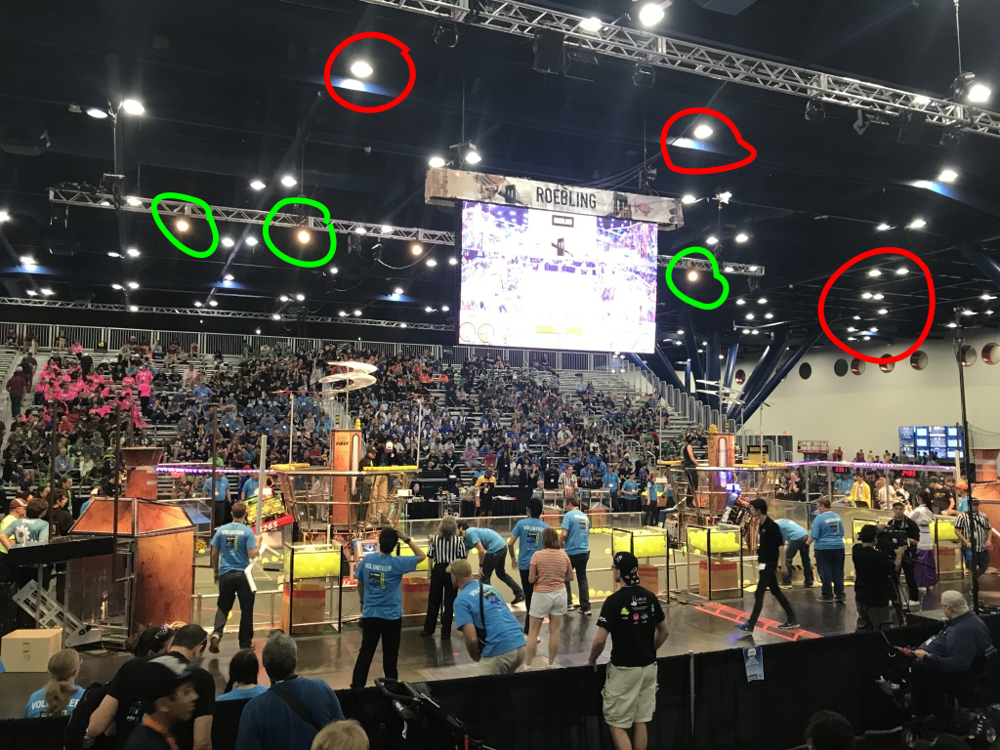

# Radiometry

The goal is to maximize the contrast of the target compared to the rest of the scene: ideally the target would be white, and the
rest of the scene would be black.  To do that, we'll illuminate the target with a narrow spectrum, and then filter the reflected light
to select just that illumination prior to the camera.
So what wavelength is best?  How bright should the light be?  What will the image look like in the camera?

We should pick a wavelength with these characteristics:

1. low ambient intensity, to maximize contrast
2. high emission efficiency, so that the emitter can be bright without getting hot
3. high filter selectivity, to minimize off-spectrum input
4. high camera sensitivity, to minimize noise

## Ambient intensity

FRC events are held in indoor basketball arenas and venues like the [Houston convention center](https://www.grbhouston.com/).  All these
locations are illuminated using overhead lighting, and some are also lit at an angle from the side, and/or (less commonly)
via windows to indirect sunlight.  It is not unheard of for gyms to allow __direct__ sunlight through a diffuser.

You can see the overhead fixtures below, circled in red, and the side-facing lights hanging from a truss, in green.

The picture shows that the overhead lights are "cool white" whereas the side-facing lights are "warm white" -- either or both might be
used in any specific venue.

The most common lighting technologies for this purpose would be [metal halide](https://en.wikipedia.org/wiki/Metal-halide_lamp)
or [white LEDs](https://en.wikipedia.org/wiki/LED_lamp#White_light_LEDs).  Since LEDs are more efficient, they are increasingly
common.

A metal halide lamp is a type of arc lamp that works by exciting metal ions, which then radiate in specific wavelengths.
The spectrum for metal halide varies by manufacturer and with the age of the bulb, but tends to look something like this:

Note the peaks in yellow and green, and the broad but low background that extends into infrared and near ultraviolet.

A white LED is a blue LED coated with one or more [phosphors](https://en.wikipedia.org/wiki/Phosphor) that absorb much of the blue light and radiate
a yellowish color.  A typical white LED spectrum looks like this:

Note the large, narrow blue peak, the much broader yellow peak, and the near-total absence of infrared.

The spectrum of diffuse sky radiation looks like this:

Note the broad blue peak, and the absence of red and infrared.

And finally, direct sunlight, less common, looks like this:

Note the scale is different for this picture.  There's a huge amount of infrared, by comparison to all the other spectra above.

## Emitter efficiency

Using the [Cree XP-E2](https://cree-led.com/media/documents/XLampXPE2.pdf) as a guide, there is a range of emitter efficiencies to choose from:

## Filter selectivity

## Camera sensitivity

